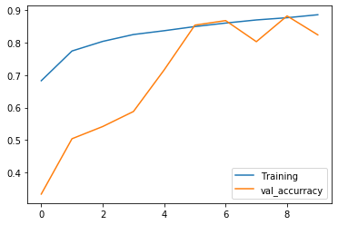
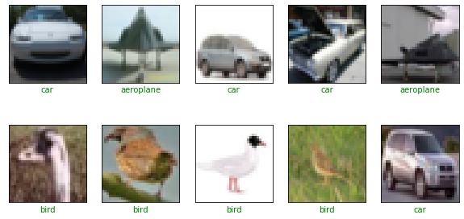

# GCP-Traffic-Signal-Classifier
This repository hosts an implementation of a Convolutional Neural Network (CNN) built using Keras with TensorFlow backend, designed to classify traffic sign images with high accuracy. Leveraging the power of Google Cloud Platform (GCP), this project provides a robust solution for real-time traffic sign recognition.

# Features:

CNN Architecture: Implemented state-of-the-art CNN architecture to efficiently recognize traffic signs.
TensorFlow Backend: Utilizes TensorFlow as the backend to ensure scalability and performance.
Google Cloud Platform Integration: Seamlessly integrates with GCP for efficient training and deployment.
Image Classification: Trains the model to classify various traffic signs accurately.
Evaluation Metrics: Provides evaluation metrics to assess the performance of the classifier.
Real-Time Inference: Enables real-time inference for quick and accurate predictions.
# Skills and Technologies Utilized:

Python: Programming language used for implementation.
Keras: High-level neural networks API, providing ease of use and flexibility.
TensorFlow: Open-source deep learning framework for building and training neural networks.
Google Cloud Platform (GCP): Cloud computing services utilized for data storage, training, and deployment.
Convolutional Neural Networks (CNNs): Deep learning models specifically designed for image classification tasks.
Image Processing: Techniques employed for preprocessing and enhancing traffic sign images.
Evaluation Metrics: Utilized to measure the performance and accuracy of the model.
Images:
Training 

# Sample dataset

# Contributing:
Contributions are welcome! Whether it's through bug fixes, feature enhancements, or documentation improvements, your help is appreciated. Please refer to the CONTRIBUTING.md file for guidelines.

# License:
This project is licensed under the MIT License - see the LICENSE.md file for details.

# Get Started:
To get started with this project, get access to each of the files, Implementation.py and supporting images.

Explore the world of traffic sign recognition with our Traffic Sign Image Classifier project! Let's make roads safer together. 🚦🚗
